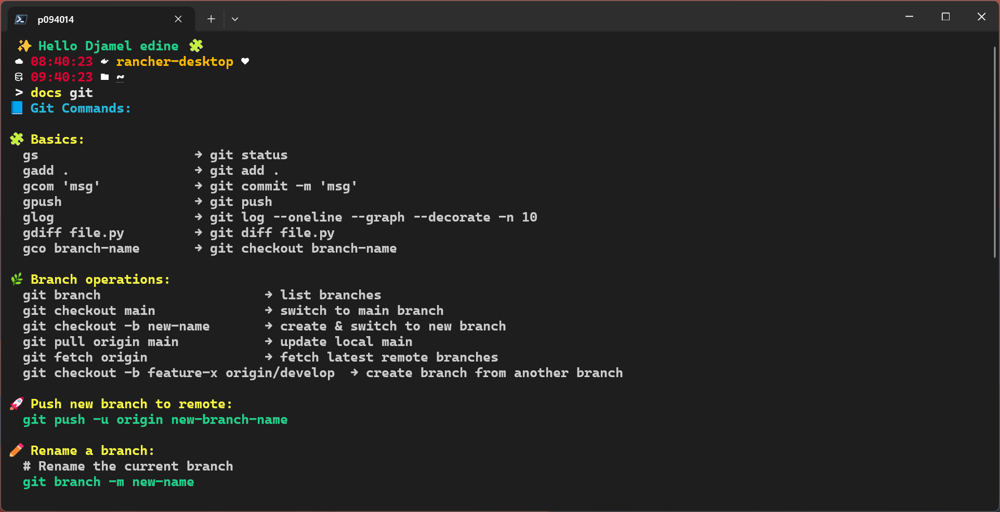

# 🧠 Dyslexic Dev Helper

Helping developers with dyslexia and ADHD remember and use CLI commands more easily — with color, structure, and simple cues.

---

## ℹ️ What Is This?

Community-driven helpers and tips to make development commands easier to read and recall. Designed for visual clarity and low cognitive load.

---

## 🔗 Table of Contents

- [ℹ️ What Is This?](#what-is-this)
- [❓ Why](#why)
- [📁 Structure](#structure)
- [▶️ Example (PowerShell)](#example-powershell)
- [⚡ PowerShell Helper](#powershell-helper)
- [🧰 VS Code Tips](#vs-code-tips)
- [🐚 Bash Helper (Coming Soon)](#bash-helper-coming-soon)
- [🤝 Contribute](#contribute)
- [📄 License](#license)

---

## ❓ Why

As a **dyslexic developer**, remembering syntax-heavy CLI commands can be frustrating.  
This tool helps by using **visual memory** — emojis, colors, and structure — to make commands easier to recall.

---

## 📁 Structure

| Folder | Description |
|---------|-------------|
| [`powershell-dev-docs-helper`](powershell-dev-docs-helper) | PowerShell helper with docs function |
| [`Bash`](Bash) | Bash version (coming soon) |
| [`vscode-tool`](vscode-tool) | VS Code tips and accessibility extensions |

---

## ▶️ Example (PowerShell)

```powershell
docs git
```

Output screenshot:



---

## ⚡ PowerShell Helper

- One function to print short, readable command reminders with colors and clear structure.
- Topics: git, docker, kube, rancher, ps, uv
- Function file: `powershell-dev-docs-helper/docs-function.ps1`

📥 Installation
- Open profile: `code $PROFILE`
- Paste the function from `powershell-dev-docs-helper/docs-function.ps1`
- Reload: `. $PROFILE`

Quick try (no profile change)
- `. .\powershell-dev-docs-helper\docs-function.ps1`
- then run: `docs git`

▶️ Usage
- `docs git`
- `docs docker`
- `docs kube`
- `docs ps`
- `docs uv`

```powershell
docs git
docs docker
docs kube
docs ps
docs uv
```

📝 Conventional Commits (mini guide)
- Format: `<type>(<scope>): <description>`
- Types: feat, fix, docs, chore, style, refactor, perf, test
- Example:
  - `feat(api): add retry logic`
  - `fix(ci): correct pipeline path`
  - `chore(deps): update requests to v2.32.3`

---

## 🧰 VS Code Tips

- 🔌 Recommended extensions are listed in `.vscode/extensions.json`:
  - Code spell checker, Better Comments, Markdown lint, Bracket colorizer, Auto-rename tag, Colorize, Material Icons, AI completion
  ```json
  {
    "recommendations": [
      "streetsidesoftware.code-spell-checker",
      "aaron-bond.better-comments",
      "DavidAnson.vscode-markdownlint",
      "CoenraadS.bracket-pair-colorizer-2",
      "formulahendry.auto-rename-tag",
      "kamikillerto.vscode-colorize",
      "PKief.material-icon-theme",
      "TabNine.tabnine-vscode"
    ]
  }
  ```
- 🧩 Editor suggestions
  - Enable current line highlight
  - Choose dyslexia-friendly fonts (e.g., Hack, Source Code Pro, OpenDyslexic)
  - Avoid extreme contrast; prefer comfortable dark themes

---

## 🐚 Bash Helper (Coming Soon)

- Planned helpers: `git-helper.sh`, `docker-helper.sh`, `kube-helper.sh`
- Goal: mirror PowerShell topics with readable, colorized output

---

## 🤝 Contribute

You can help by:
- Adding a new helper (Bash, Zsh, etc.)
- Improving readability
- Translating into other languages
- Sharing feedback

PRs welcome — everyone’s brain works differently; visual clarity helps many of us.

## ❤️ Credits
Created by **[Djamel-Edine Yagoubi](https://github.com/djamelinfo)**  
Inspired by real challenges faced by dyslexic developers and the power of color & structure in learning.
